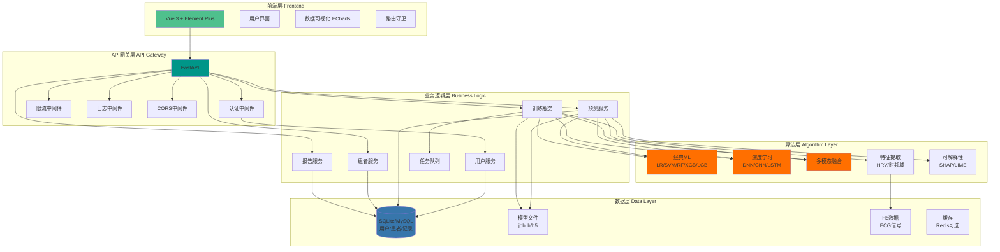
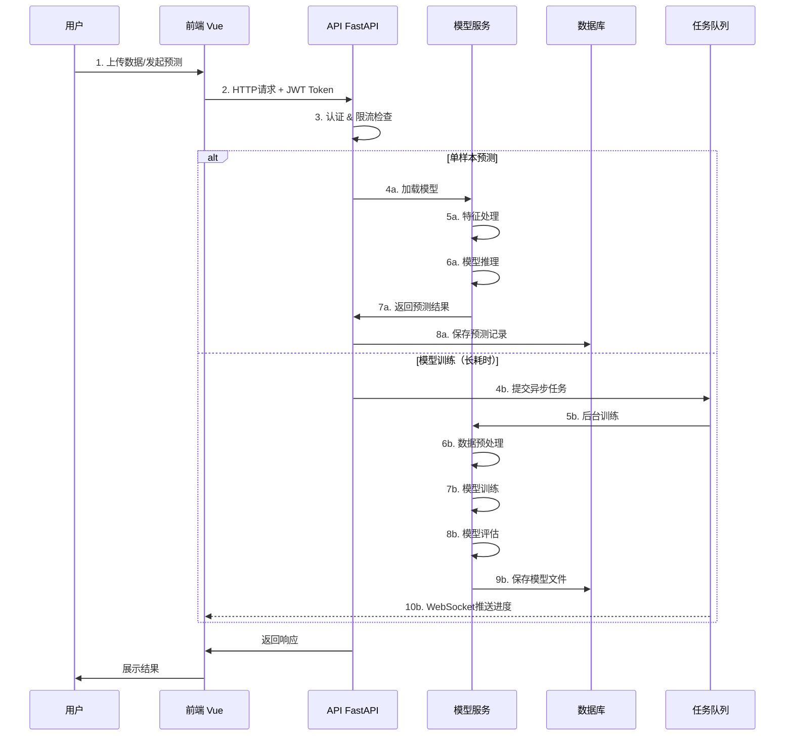

# HeartCycle CAD System

<div align="center">


**基于机器学习与深度学习的冠心病风险预测智能平台**

[](https://www.python.org/)
[](https://fastapi.tiangolo.com/)
[](https://vuejs.org/)
[](https://www.tensorflow.org/)
[](https://www.docker.com/)
[](LICENSE)

[在线演示](#) | [快速开始](#-快速开始) | [文档](docs/README.md) | [API文档](#-api文档)

</div>

---

## 📖 目录

- [项目简介](#-项目简介)
- [核心特性](#-核心特性)
- [系统架构](#-系统架构)
- [技术栈](#-技术栈)
- [功能展示](#-功能展示)
- [快速开始](#-快速开始)
- [Docker部署](#-docker部署)
- [项目结构](#-项目结构)
- [API文档](#-api文档)
- [开发指南](#-开发指南)
- [性能指标](#-性能指标)
- [常见问题](#-常见问题)
- [许可证](#-许可证)

---

## 🎯 项目简介

HeartCycle CAD System 是一个**全栈医疗AI平台**，专注于冠状动脉疾病（Coronary Artery Disease, CAD）的智能风险预测与辅助诊断。系统整合了经典机器学习、深度学习和多模态融合技术，支持从临床表格特征和原始心电图（ECG）信号进行智能分析。

### 🎓 项目背景

- **应用场景**：临床辅助诊断、医学科研、健康管理、医学教育
- **项目类型**：毕业设计 / 医疗AI科研平台
- **开发规模**：~60,000行代码，20+功能页面，23个API模块
- **技术亮点**：多模态融合、可解释AI、异步任务队列、模型版本管理

### 🌟 为什么选择 HeartCycle？

✅ **完整的医疗AI工作流**：数据上传 → 特征提取 → 模型训练 → 预测分析 → 可解释性 → 报告生成  
✅ **多模态融合**：表格临床特征 + 原始ECG信号深度融合  
✅ **可解释性优先**：SHAP/LIME让AI决策透明化，符合医疗场景需求  
✅ **企业级工程实践**：异步任务、版本管理、系统监控、安全认证  
✅ **开箱即用**：Docker一键部署，完整的文档和示例数据

---

## ✨ 核心特性

<table>
<tr>
<td width="50%">

### 🔐 用户管理与权限
- JWT双令牌认证机制
- 四级权限体系（管理员/医生/研究员/患者）
- IP限流（200次/分钟）+ 用户限流（1000次/小时）
- 完整的审计日志系统

### 🤖 智能预测
- 单样本实时预测（秒级响应）
- CSV批量预测
- 多模态融合预测
- 风险分层（低/中/高）

### 🧠 模型训练
- 7种经典ML算法（LR/SVM/RF/XGB/LGB/Stacking/Voting）
- 深度学习（DNN/CNN/LSTM）
- 多模态融合模型
- 自动超参数优化

</td>
<td width="50%">

### 📊 ECG信号处理
- H5格式转换与可视化
- HRV特征提取（60+维）
  - 时域特征（SDNN、RMSSD、pNN50等）
  - 频域特征（LF、HF、LF/HF等）
  - 非线性特征（样本熵、近似熵等）
- 基于NeuroKit2的专业信号处理

### 🔍 可解释性分析
- SHAP局部解释 + 全局特征重要性
- LIME模型解释
- 特征贡献度可视化
- 与预测流程深度集成

### 📈 系统监控
- CPU/内存/磁盘实时监控
- 请求日志与性能指标
- 缓存管理
- 健康检查接口

</td>
</tr>
</table>

---

## 🏗️ 系统架构

### 整体架构图




### 数据流程图



### 技术架构分层

| 层级 | 技术选型 | 职责 |
|------|---------|------|
| **表现层** | Vue 3 + Element Plus + ECharts | 用户交互、数据可视化 |
| **网关层** | FastAPI + 中间件 | 路由、认证、限流、日志 |
| **服务层** | Python Services | 业务逻辑封装 |
| **算法层** | scikit-learn + TensorFlow + NeuroKit2 | ML/DL模型、信号处理 |
| **数据层** | SQLAlchemy + 文件系统 | 数据持久化 |
| **基础设施** | Docker + Nginx + Uvicorn | 容器化部署 |

---

## 💻 技术栈

### 后端技术栈

<table>
<tr>
<td width="30%"><b>分类</b></td>
<td width="70%"><b>技术</b></td>
</tr>
<tr>
<td><b>Web框架</b></td>
<td>FastAPI 0.100+, Uvicorn (ASGI), Pydantic v2</td>
</tr>
<tr>
<td><b>数据库</b></td>
<td>SQLAlchemy 2.0, SQLite/MySQL, Alembic</td>
</tr>
<tr>
<td><b>认证安全</b></td>
<td>JWT (python-jose), Bcrypt, 双重限流</td>
</tr>
<tr>
<td><b>经典ML</b></td>
<td>scikit-learn, XGBoost, LightGBM, imbalanced-learn (SMOTE)</td>
</tr>
<tr>
<td><b>深度学习</b></td>
<td>TensorFlow 2.13, Keras</td>
</tr>
<tr>
<td><b>信号处理</b></td>
<td>NeuroKit2, SciPy, PyWavelets, h5py</td>
</tr>
<tr>
<td><b>可解释性</b></td>
<td>SHAP, LIME</td>
</tr>
<tr>
<td><b>数据处理</b></td>
<td>NumPy, Pandas, joblib</td>
</tr>
<tr>
<td><b>可视化</b></td>
<td>Matplotlib, Seaborn, Plotly</td>
</tr>
<tr>
<td><b>报告生成</b></td>
<td>ReportLab (PDF)</td>
</tr>
<tr>
<td><b>系统监控</b></td>
<td>psutil, 自定义性能指标</td>
</tr>
</table>

### 前端技术栈

<table>
<tr>
<td width="30%"><b>分类</b></td>
<td width="70%"><b>技术</b></td>
</tr>
<tr>
<td><b>核心框架</b></td>
<td>Vue 3 (Composition API), Vue Router 4</td>
</tr>
<tr>
<td><b>UI组件库</b></td>
<td>Element Plus 2.x (完整企业级组件)</td>
</tr>
<tr>
<td><b>数据可视化</b></td>
<td>ECharts 5.x, vue-echarts</td>
</tr>
<tr>
<td><b>国际化</b></td>
<td>Vue I18n (中英文)</td>
</tr>
<tr>
<td><b>HTTP客户端</b></td>
<td>Axios (拦截器、Token自动刷新)</td>
</tr>
<tr>
<td><b>构建工具</b></td>
<td>Vue CLI 5, Webpack</td>
</tr>
<tr>
<td><b>代码规范</b></td>
<td>ESLint, Prettier</td>
</tr>
</table>

### DevOps & 部署

- **容器化**: Docker, docker-compose
- **Web服务器**: Nginx (前端), Uvicorn (后端)
- **版本控制**: Git, GitHub
- **CI/CD**: 支持 GitHub Actions (可选)

---

## 📸 功能展示

### 1. 登录与首页


*JWT认证登录，支持记住密码*


*清晰的功能导航，角色权限控制*

### 2. 风险预测


*实时风险预测，秒级响应，SHAP可解释性分析*


*CSV批量预测，支持导出结果*

### 3. 模型训练


*可视化训练向导，支持CSV和H5数据*


*详细的训练指标：准确率、精确率、召回率、F1、AUC-ROC*


*混淆矩阵可视化*

### 4. ECG信号处理


*ECG波形实时可视化，支持多导联*


*自动提取60+维HRV特征*

### 5. 可解释性分析


*SHAP瀑布图：单样本特征贡献度*


*全局特征重要性排序*

### 6. 模型版本管理


*模型版本对比、激活、回滚*

### 7. 患者管理


*患者档案管理，支持搜索和筛选*


*患者详情：基本信息、预测历史、随访记录*

### 8. 系统监控


*实时系统监控：CPU、内存、磁盘、请求统计*


*详细的性能指标和日志*

---

## 🚀 快速开始

### 环境要求

- **Python**: 3.9+
- **Node.js**: 16+ (推荐 18 LTS)
- **内存**: 8GB+ (训练深度学习模型时)
- **磁盘**: 10GB+ 可用空间
- **可选**: Docker 20+, Docker Compose v2

### 1. 克隆项目


```bash
git clone https://github.com/wenjinqing/HeartCycle-CAD-System.git
cd HeartCycle-CAD-System/heartcycle_cad_system
```

### 2. 配置环境变量

```bash
cp .env.example .env
```

### 3. 启动后端

```bash
pip install -r requirements.txt
cd backend
uvicorn app.main:app --reload --host 0.0.0.0 --port 8000
```

### 4. 启动前端

```bash
cd frontend
npm install
npm run serve
```

访问 http://localhost:8080

---

## 📊 性能指标

- 单样本预测: <500ms
- 批量预测: ~1000样本/分钟
- 模型准确率: 85-90%
- AUC-ROC: 0.91-0.95

---

## 📄 许可证

学术研究使用，不得用于商业用途。

---

## 🙏 致谢

感谢 FastAPI、Vue.js、scikit-learn、TensorFlow 等开源项目。

---

<div align="center">

Made with ❤️ by wenjinqing

</div>
