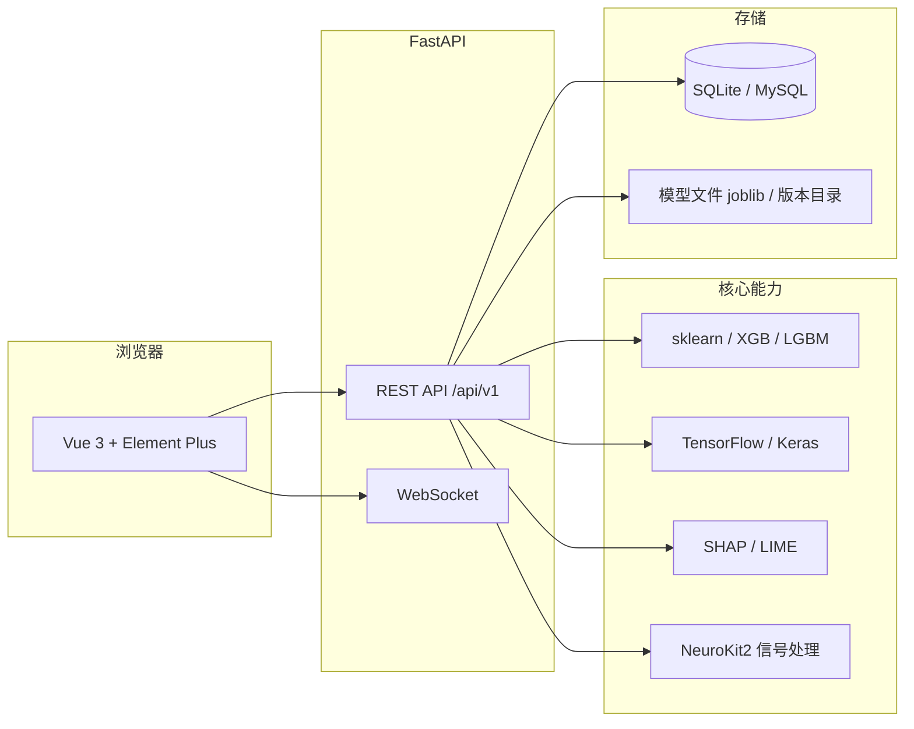

# HeartCycle CAD System

<p align="center">
  <strong>基于机器学习的冠心病（CAD）风险预测 Web 平台</strong><br/>
  <sub>毕业设计 / 科研原型 · 前后端分离 · 可解释 AI</sub>
</p>

<p align="center">
  
  
  
  
  
</p>

**English (short):** HeartCycle CAD System is a full-stack web application for coronary artery disease risk prediction from tabular clinical/HRV features or raw ECG (H5). It ships with JWT auth, role-based access, classical ML and optional deep / multimodal workflows, SHAP explanations, model registry, batch prediction, and deployment-oriented Docker assets.

---

## 目录

- [功能概览](#功能概览)
- [系统架构](#系统架构)
- [技术栈](#技术栈)
- [目录结构](#目录结构)
- [环境要求](#环境要求)
- [快速开始](#快速开始)
- [Docker 部署](#docker-部署)
- [用户角色与权限](#用户角色与权限)
- [前端功能地图](#前端功能地图)
- [API 一览](#api-一览)
- [数据与特征](#数据与特征)
- [支持的模型](#支持的模型)
- [配置说明](#配置说明)
- [文档与排障](#文档与排障)
- [安全与合规](#安全与合规)
- [许可证与免责声明](#许可证与免责声明)
- [致谢](#致谢)

---

## 功能概览

| 模块 | 说明 |
|------|------|
| **认证与授权** | JWT 访问令牌 / 刷新令牌；管理员、医生、研究员、患者等多角色；路由级权限控制。 |
| **风险预测** | 单样本预测、**服务端批量预测**、集成预测；风险等级与概率；可对接患者档案。 |
| **模型训练** | **CSV 特征训练**（同步）；**H5 原始 ECG 训练**（异步任务 + 进度）；H5 自动标签流程；可选 **深度学习**、**多模态融合** 实验入口。 |
| **模型与版本** | 磁盘 `model_id` 管理；**模型版本库**（上传 / 登记 / 激活）；训练完成后可发布到版本页。 |
| **可解释性** | SHAP 单样本解释、全局特征重要性；与监测 / 训练结果联动展示。 |
| **数据与信号** | CSV 上传；H5 批量上传与转换；H5 可视化；特征提取与选择相关 API。 |
| **患者与报告** | 患者列表与详情（医护角色）；报告生成与导出（含 PDF 等能力，见前端实现）。 |
| **系统能力** | 请求日志、**限流**、可选缓存与健康检查；管理端用户与审计；系统监控（管理员）。 |
| **论文实验** | 论文实验相关页面与后端实验路由（需相应角色）。 |

---

## 系统架构



---

## 技术栈

| 层级 | 技术 |
|------|------|
| 前端 | Vue 3、Vue Router、Vue I18n、Element Plus、ECharts、vue-echarts、Axios |
| 后端 | FastAPI、Uvicorn、Pydantic v2、SQLAlchemy |
| 经典 ML | scikit-learn、imbalanced-learn（SMOTE 等）、XGBoost、LightGBM |
| 深度学习 | TensorFlow、Keras（按需安装） |
| 可解释性 | SHAP、LIME |
| 信号与数据 | NumPy、Pandas、SciPy、h5py、NeuroKit2、PyWavelets |
| 运维 | Docker / docker-compose、Nginx（前端镜像）、可选 Redis |

---

## 目录结构

```
heartcycle_cad_system/
├── backend/
│   ├── algorithms/           # 算法库：预处理、特征、训练、深度学习、多模态等
│   ├── app/
│   │   ├── api/v1/         # REST 路由：auth、models、shap、patients、model_versions…
│   │   ├── core/           # 配置、工具、异常
│   │   ├── db/             # ORM 与迁移辅助
│   │   ├── middleware/     # 日志、限流等
│   │   ├── models/         # Pydantic / 业务模型
│   │   ├── services/       # 业务服务层
│   │   └── main.py         # 应用入口
│   └── run_experiment.py   # 实验脚本入口（可选）
├── frontend/
│   ├── src/
│   │   ├── views/          # 页面：监测、训练、批量预测、模型版本、患者…
│   │   ├── components/     # 通用组件与图表
│   │   ├── services/       # API 封装
│   │   ├── router/         # 路由与守卫
│   │   ├── locales/        # 国际化
│   │   └── utils/          # 工具函数
│   └── public/
├── docs/                     # 详细文档（guides / thesis / history / notes）
├── scripts/                  # 启动脚本、训练与数据工具
├── docker-compose.yml
├── Dockerfile                # 后端镜像
├── frontend/Dockerfile       # 前端构建 + Nginx
├── .env.example              # 环境变量模板（复制为 .env）
├── requirements.txt
└── README.md                 # 本文件
```

> 若仓库根目录还包含其它子项目，请以本目录 `heartcycle_cad_system/` 为工作根路径执行下文命令。

---

## 环境要求

- **Python** 3.9+
- **Node.js** 16+（推荐 18 LTS）与 npm
- 可选：**Docker** 20+、Docker Compose v2
- 训练深度学习 / 大体积数据时建议 **8GB+ 内存** 与足够磁盘空间

---

## 快速开始

### 1. 获取代码

```bash
git clone <你的仓库 URL>.git
cd <仓库目录>/heartcycle_cad_system
```

### 2. 配置环境变量

```bash
cp .env.example .env
# 编辑 .env：至少设置 SECRET_KEY；生产环境配置 DATABASE_URL、CORS 等
```

**切勿**将真实 `.env`、`*.db` 中的生产口令、或含真实患者数据的文件提交到 Git。

### 3. 安装并启动后端

```bash
pip install -r requirements.txt
cd backend
uvicorn app.main:app --reload --host 0.0.0.0 --port 8000
```

或使用仓库脚本（默认端口以脚本为准，常见为 **8009**，前端 `backendDetector` 会尝试探测）：

```bash
python scripts/start_backend.py
```

- **Swagger UI：** http://localhost:8000/docs  
- **ReDoc：** http://localhost:8000/redoc  
（若端口非 8000，请替换主机端口。）

### 4. 安装并启动前端

```bash
cd frontend
npm install
npm run serve
# 或 npm run dev  （默认 8080，见 package.json）
```

### 5. 访问应用

| 页面 | 默认地址（示例） |
|------|------------------|
| 前端 | http://localhost:8080 |
| 后端 API | http://localhost:8000/api/v1 |

首次使用需在系统中注册/登录账号（具体以部署时的种子用户或注册接口为准）。

---

## Docker 部署

在项目根目录 `heartcycle_cad_system/`：

```bash
docker compose up -d --build
```

- 后端默认映射 **8000**；前端 Nginx 默认映射 **80**。  
- 可通过环境变量覆盖 `SECRET_KEY`、`DEBUG`、`DATABASE_URL` 等（参见 `docker-compose.yml`）。  
- 更完整的参数与生产建议见 **[docs/guides/DEPLOYMENT.md](./docs/guides/DEPLOYMENT.md)**。

---

## 用户角色与权限

| 角色 | 典型能力 |
|------|-----------|
| **admin** | 用户与审计、仪表盘、系统监控、全部科研与医护功能。 |
| **doctor** | 患者管理、预测与报告、部分训练/分析功能（以前端路由 `meta.roles` 为准）。 |
| **researcher** | 模型训练、批量预测、模型版本、论文实验、H5 工具等。 |
| **patient** | 个人相关预测记录等（以前端与后端接口约定为准）。 |

实际接口层另有 `require_staff`、`require_researcher` 等依赖，与界面路由共同约束权限。

---

## 前端功能地图

| 路径 | 功能 |
|------|------|
| `/` | 首页 |
| `/login` | 登录 |
| `/monitor` | 单样本风险预测与解释 |
| `/batch-predict` | 批量预测 |
| `/train` | CSV / H5 训练向导 |
| `/train-h5-auto` | H5 自动标签训练 |
| `/train-deep-learning` | 深度学习训练 |
| `/train-multimodal` | 多模态训练 |
| `/h5-converter` | H5 转换 |
| `/h5-visualize` | H5 可视化 |
| `/history` | 历史记录 |
| `/model-versions` | 模型版本管理 |
| `/models/:id` | 模型详情 |
| `/patients` | 患者列表 |
| `/patients/:id` | 患者详情 |
| `/reports` | 报告 |
| `/thesis-experiment` | 论文实验 |
| `/dashboard` | 管理仪表盘 |
| `/system-monitor` | 系统监控 |
| `/admin/users`、`/admin/audit-logs` | 用户与审计 |

---

## API 一览

统一前缀：`/api/v1`（与 `.env` 中 `API_V1_PREFIX` 一致）。

| 领域 | 方法 | 路径示例 | 说明 |
|------|------|-----------|------|
| 认证 | POST | `/auth/register`、`/auth/login`、`/auth/refresh` | 注册、登录、刷新令牌 |
| 数据 | POST | `/data/upload` | 文件上传 |
| 训练 | POST | `/train` | CSV 同步训练 |
| 训练 | POST | `/train/h5` | 启动 H5 异步训练 |
| 训练 | GET | `/train/h5/{task_id}` | 查询 H5 训练任务 |
| 模型 | GET | `/models`、`/models/{model_id}` | 列表与详情 |
| 预测 | POST | `/predict`、`/predict/batch` | 单条与批量预测 |
| SHAP | POST | `/shap/explain/instance`、`/shap/explain/global` | 局部 / 全局解释 |
| 模型版本 | * | `/model-versions/*` | 版本 CRUD、从训练登记等 |
| 患者 / 报告 | * | `/patients/*`、`/reports/*` | 业务接口 |
| 其它 | * | `/h5/*`、`/deep-learning/*`、`/multimodal/*`、`/experiment/*`、`/monitor/*`… | 见 Swagger |

完整列表与字段说明：**[docs/guides/API.md](./docs/guides/API.md)**。

---

## 数据与特征

### CSV 特征训练

特征文件需包含与系统约定一致的列（如年龄、性别、身高、体重及 HRV 相关字段等）。具体列说明见前端上传提示与 **[docs/guides/DATA_LOCATION_GUIDE.md](./docs/guides/DATA_LOCATION_GUIDE.md)**。

### H5 ECG

支持批量上传与转换；训练流程从原始波形提取 HRV 等特征后再进入经典 ML 管线。详见 **重要提示** 与 H5 相关 notes：`docs/notes/`、`docs/guides/README_重要提示.md`。

---

## 支持的模型

| 代码 | 模型 | 说明 |
|------|------|------|
| `lr` | 逻辑回归 | 线性、可解释 |
| `svm` | 支持向量机 | 小样本常用 |
| `rf` | 随机森林 | 稳定、基线强 |
| `xgb` | XGBoost | 梯度提升 |
| `lgb` | LightGBM | 训练快 |
| `stacking` | Stacking | 多基学习器堆叠 |
| `voting` | Voting | 投票集成 |

深度学习与多模态路径见对应前端页面与 `backend/algorithms/` 下模块。

---

## 配置说明

| 变量（示例） | 含义 |
|--------------|------|
| `SECRET_KEY` | JWT 签名密钥，**生产必须更换** |
| `DATABASE_URL` | 默认 SQLite；可改为 MySQL 等 |
| `DEBUG` | 开发调试与 CORS 宽松策略 |
| `CORS_ORIGINS` | 生产环境允许的前端源（JSON 数组字符串） |
| `API_V1_PREFIX` | API 前缀，默认 `/api/v1` |

完整项见 `.env.example`。

---

## 文档与排障

| 资源 | 链接 |
|------|------|
| 文档索引 | [docs/README.md](./docs/README.md) |
| 中文导航 | [文档导航.md](./文档导航.md) |
| 快速使用 | [docs/guides/快速使用指南.md](./docs/guides/快速使用指南.md) |
| 部署 | [docs/guides/DEPLOYMENT.md](./docs/guides/DEPLOYMENT.md) |
| API | [docs/guides/API.md](./docs/guides/API.md) |
| 论文相关 | [docs/thesis/README_THESIS.md](./docs/thesis/README_THESIS.md) |
| 变更与阶段总结 | [docs/history/CHANGELOG.md](./docs/history/CHANGELOG.md) 等 |

---

## 安全与合规

- 不要将 **`.env`、数据库文件、真实患者数据、含口令的 JSON** 推送到公开仓库。  
- 本系统为 **科研 / 教学演示** 用途，**不能**作为临床诊疗依据。任何真实医疗决策须遵循法规并由专业人员作出。

---

## 许可证与免责声明

- 本项目声明为 **学术使用**（见仓库 License 文件或院系要求为准）。  
- 使用 HeartCycle / PhysioNet 等数据时，请遵守各自 **数据使用协议** 与引用要求。

---

## 致谢

- [FastAPI](https://fastapi.tiangolo.com/)、[Vue.js](https://vuejs.org/)、[Element Plus](https://element-plus.org/)  
- [scikit-learn](https://scikit-learn.org/)、[XGBoost](https://xgboost.readthedocs.io/)、[LightGBM](https://lightgbm.readthedocs.io/)  
- [SHAP](https://github.com/slundberg/shap)、[NeuroKit2](https://neuropsychology.github.io/NeuroKit/)  
- 数据与文献来源请在论文或 `docs/thesis/` 中按规范引用  

---

<p align="center">
  <b>HeartCycle CAD System</b> · 冠心病风险预测 · 持续迭代中<br/>
  如有问题请先查阅 <code>docs/</code>，欢迎提 Issue 与 PR
</p>
