# HeartCycle 冠心病风险预测系统——论文用技术说明（详尽版）

本文档面向学位论文撰写，**以仓库实现为准**逐层展开：目录与配置、数据与特征、信号处理、训练/推理数值管线、持久化与 API、前端契约、可解释性与集成学习等。不重复教科书级定义；数值阈值、分支条件、文件名与字段名均可在代码中核对。

**阅读顺序建议**：先读 **「甲、主要技术框架」** 与 **「乙、核心业务流程」** 建立全局视图，再读后续各节参数与实现细节。

---

## 甲、主要技术框架

### 甲.1 逻辑分层（论文「系统架构」可直接引用）

系统按 **五层** 组织，自顶向下调用关系如下（下层为上层提供能力，同层模块通过接口协作）。

| 层级 | 名称 | 本仓库对应物 | 职责（实现向） |
|------|------|----------------|----------------|
| L1 | **表现层** | `frontend/`（Vue 3 + Element Plus + ECharts + vue-router + vue-i18n） | 路由与权限元数据、表单/表格、监测页特征拼装、图表与 PDF 前端导出、axios 统一鉴权与重试。 |
| L2 | **接入层 / API 网关语义** | FastAPI `app.main:app`，前缀 `API_V1_PREFIX`（默认 `/api/v1`） | HTTP/JSON 契约、依赖注入（`Depends(get_db)`、`get_current_user`）、全局异常与 CORS、限流与请求日志中间件。 |
| L3 | **应用服务层** | `backend/app/services/*.py` | 训练任务生命周期、模型预测编排、集成预测、SHAP 调用、患者 CRUD、报告生成、多模态/深度学习等门面服务。 |
| L4 | **领域算法层** | `backend/app/algorithms/*.py`（及历史 `backend/algorithms/` 双路径注意） | 无 HTTP 耦合：`ECGProcessor`、`HRVFeatureExtractor`、`ModelTrainer` 纯数值与 I/O。 |
| L5 | **数据与资源层** | SQLAlchemy ORM + SQLite/MySQL；`data/` 下 raw/processed/features/models；`joblib` 模型文件 | 患者与预测记录持久化；训练数据与模型制品落盘；启动时 DDL 与患者表迁移。 |

**横向切面**（贯穿多层）：JWT 认证与角色策略、结构化日志、`pydantic`/`pydantic-settings` 配置校验、可选 MySQL 任务存储。

### 甲.2 主要技术栈矩阵（按论文「开发环境 / 技术选型表」使用）

| 类别 | 选用技术 | 在系统中的落点 |
|------|-----------|----------------|
| 前端运行时与构建 | Vue 3、Vue Router 4、Vue CLI | SPA 单页应用，`src/views` 按业务拆页。 |
| UI 与可视化 | Element Plus、ECharts、vue-echarts | 表单/对话框/表格；ROC、趋势、训练曲线等。 |
| HTTP 客户端 | axios 1.x | `services/api.js`：拦截器、刷新令牌、错误重试、Blob 下载。 |
| Web 框架 | FastAPI + Uvicorn | 异步 ASGI，OpenAPI 文档 `/docs`。 |
| 数据校验与配置 | Pydantic v2、 pydantic-settings | 请求体/响应体模型；`Settings` 环境变量。 |
| ORM 与数据库 | SQLAlchemy 2.x | `Patient`/`User`/`PredictionRecord`；会话 `get_db`。 |
| 表格与数值计算 | pandas、numpy、scipy | 训练数据读入、Welch 谱、信号滤波。 |
| 信号与 H5 | h5py、NeuroKit2（依赖）、自研 Pan-Tompkins 桥接 | HDF5 读入、RR 与 HRV 特征链。 |
| 传统机器学习 | scikit-learn、imbalanced-learn、XGBoost、LightGBM | 分类器、Pipeline、SMOTE、交叉验证、网格搜索。 |
| 可解释性 | SHAP、LIME（依赖） | `SHAPService` 树/线性/核解释器分支。 |
| 深度学习（扩展） | TensorFlow/Keras | `deep_learning` 路由及相关服务。 |
| 报告 | ReportLab | 服务端 PDF；手机号脱敏、患者信息表。 |
| 序列化 | joblib | 模型+scaler+imputer+元数据一体保存。 |

### 甲.3 组件依赖关系（静态结构）

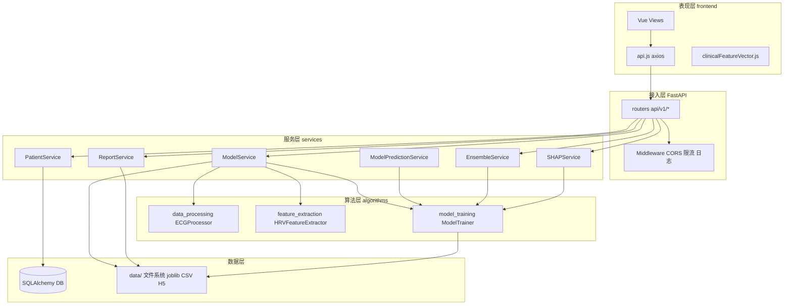

---

## 乙、核心业务流程（端到端）

下列流程与代码路径对应，论文「业务流程图」「时序图」可据此绘制或截 Mermaid。

### 乙.1 业务总览：两条主链路

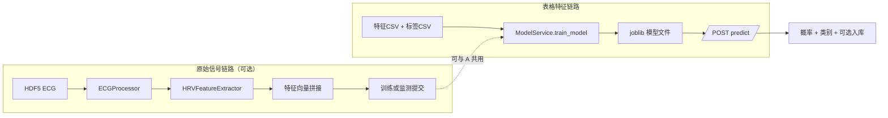

### 乙.2 CSV 离线训练流程（同步路径概要）

典型入口：`POST /api/v1/models/train`（具体以 `models.py` 为准）→ `ModelService.train_model` 读入特征/标签 CSV → 调用 `ModelTrainer.train` → 交叉验证与指标汇总 → `save(model_id)` 写 `joblib`。

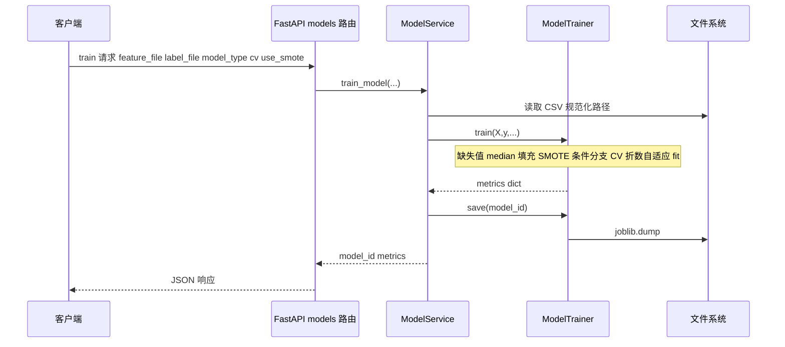

**训练任务异步路径**（若使用任务队列）：创建 `task_id` → 后台线程或队列执行上述 `ModelTrainer` 步骤 → 客户端轮询 `tasks` 或 WebSocket 推送状态（以 `tasks`/`websocket` 实现为准）。

### 乙.3 单模型在线预测流程

入口：`POST /api/v1/models/predict`，体为 `model_id` + `features[]`，可选 `patient_id`。

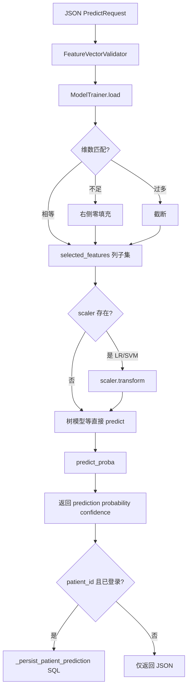

**风险分档与入库**：正类概率 `p1` → `p1≥0.66→high`；`≥0.33→medium`；否则 `low`；入库字段含 `probability` JSON、`risk_level`、`model_id`、可选 `input_features` JSON。

### 乙.4 多模型集成预测流程

入口：`POST /api/v1/models/predict/ensemble`，体为 `model_ids[]`、`features`、`method`（`voting`|`weighted`）、可选 `weights`。

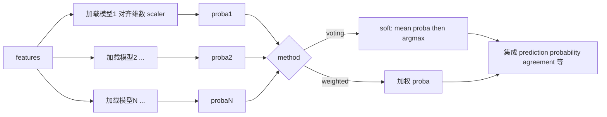

单模型时 `EnsembleService` 直接委托 `ModelService.predict` 以复用逻辑。

### 乙.5 监测页从填表到预测（前端 + 后端）

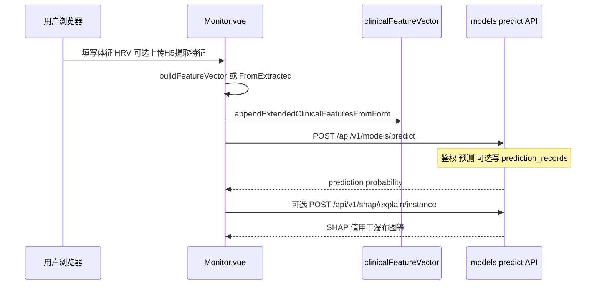

### 乙.6 H5 → RR → HRV 信号处理流程（算法层）

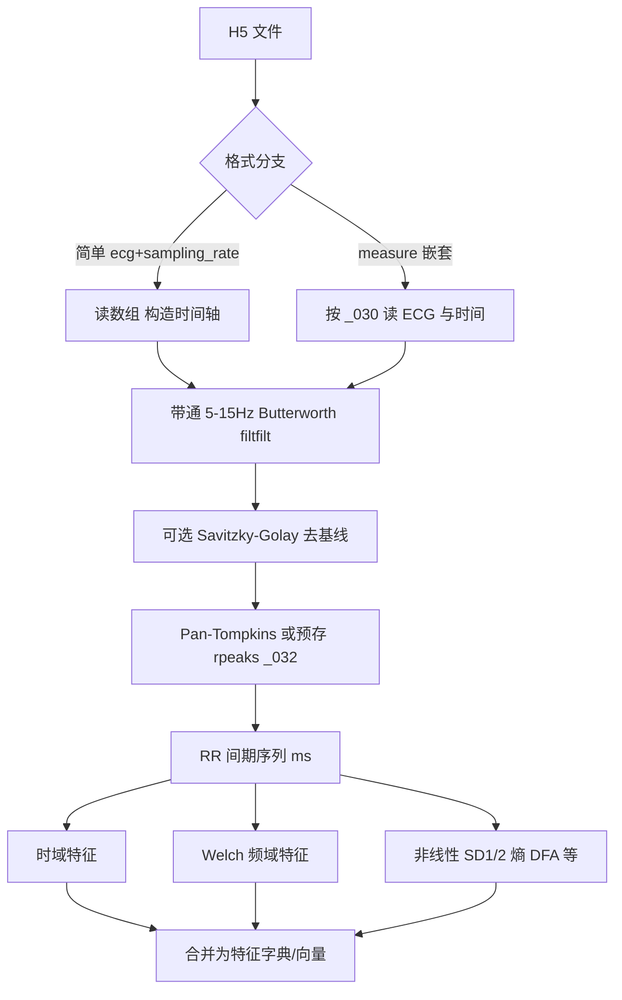

### 乙.7 SHAP 单样本解释流程

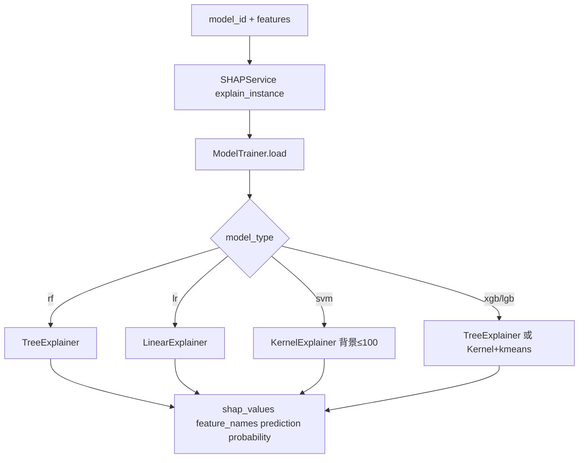

### 乙.8 患者档案与 PDF 报告流程

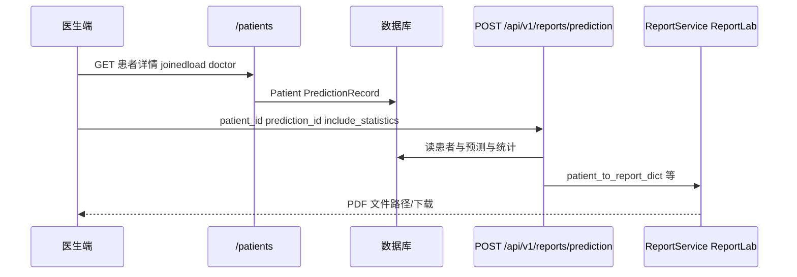

### 乙.9 应用启动与数据库模式演进

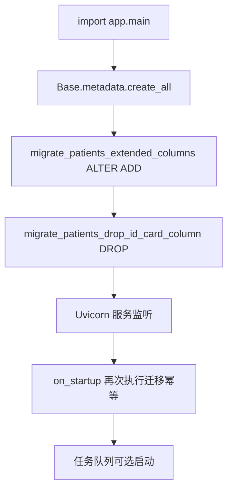

### 乙.10 前端鉴权与路由命中流程

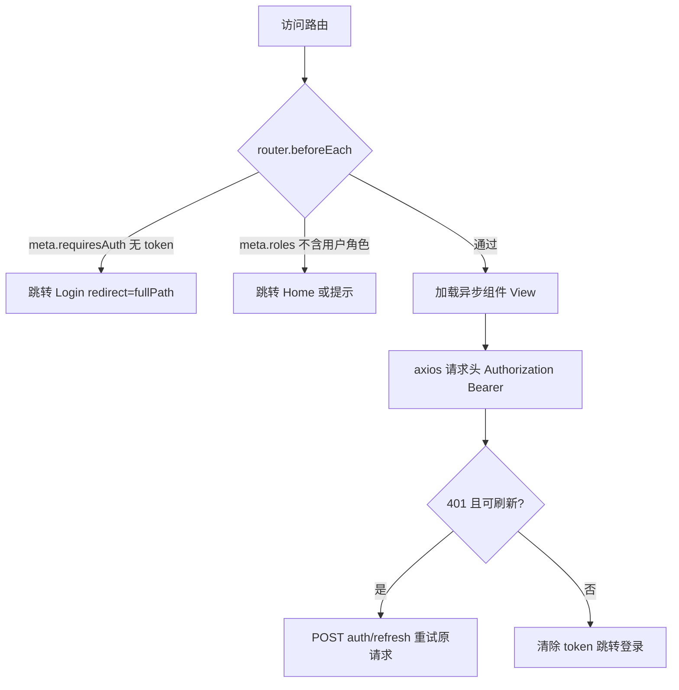

---

## 1. 系统边界与符号约定

- **任务形态**：二分类（标签 `y ∈ {0,1}`，具体语义由数据集标签定义）。模型输出包含类别与 `predict_proba` 返回的 `[P(0), P(1)]`。
- **特征入口两类**：（1）对齐后的表格特征矩阵 CSV；（2）HDF5 中 ECG → RR → HRV 特征，再与临床表格式特征拼接（由 H5 训练/特征服务编排）。
- **API 根前缀**：`settings.API_V1_PREFIX`，默认 **`/api/v1`**（见 `backend/app/core/settings.py`）。
- **随机种子**：`ModelTrainer` 默认 `random_state=42`；与 `Settings.DEFAULT_RANDOM_STATE` 一致。

---

## 2. 工程目录与职责对照

| 路径 | 职责摘要 |
|------|-----------|
| `backend/app/main.py` | FastAPI 实例、全局异常处理、CORS、限流与日志中间件、`create_all`、患者表迁移（扩展列 + 删除废弃列）、路由挂载、启动/关闭钩子（任务队列等）。 |
| `backend/app/core/settings.py` | Pydantic Settings：`BASE_DIR`（项目根）、`DATA_ROOT`/`UPLOAD_DIR`/`PROCESSED_DIR`/`FEATURES_DIR`/`MODELS_DIR`、`DATABASE_URL`、`API_V1_PREFIX`、上传大小与超时等。 |
| `backend/app/db/base.py` | `engine`、`SessionLocal`、`get_db`、`migrate_patients_extended_columns`、`migrate_patients_drop_id_card_column`、`init_db`。 |
| `backend/app/models/user.py` | ORM：`User`、`Patient`、`PredictionRecord` 及关系；患者字段含体征、实验室、生活方式与合并症布尔编码等。 |
| `backend/app/models/auth.py` | Pydantic：`PatientCreate`/`Update`/`Response` 等与 API 契约；`birth_date` 空串清洗。 |
| `backend/app/api/v1/*.py` | 按域拆分的路由：数据、特征、特征选择、模型、SHAP、H5、认证、患者、报告、任务、实验、多模态等。 |
| `backend/app/services/*.py` | 业务编排：`ModelService`（训练任务、预测入口）、`ModelPredictionService`、`EnsembleService`、`SHAPService`、`PatientService`、`ReportService` 等。 |
| `backend/app/algorithms/*.py` | 数值核心：`data_processing`、`feature_extraction`、`model_training`；与 `services` 通过 `sys.path` 衔接 legacy `algorithms` 包时需留意双份路径（以实际 `import` 为准）。 |
| `frontend/src/views/*.vue` | 页面级：监测、训练、患者、报告、实验等。 |
| `frontend/src/services/api.js` | axios 实例、重试、JWT 刷新、后端基址探测。 |
| `frontend/src/utils/clinicalFeatureVector.js` | **与后端训练维序对齐**的扩展临床维度追加逻辑。 |

---

## 3. 配置与数据落盘

### 3.1 路径约定（`Settings`）

- **`BACKEND_DIR`**：`backend` 目录；**`BASE_DIR`**：其上一级，即项目根 `heartcycle_cad_system`。
- **数据目录**：`data/raw`、`data/processed`、`data/features`、`data/models` 等相对 `BASE_DIR` 解析；SQLite 默认文件落在项目根下 `data/heartcycle.db`（在 `model_post_init` 中转为绝对路径）。
- **模型文件**：由 `app.core.utils.get_model_file_path` 等与 `MODELS_DIR` 绑定；训练结束 `joblib.dump` 写入。

### 3.2 依赖版本下界（`requirements.txt`）

与论文「实验环境」可对应罗列：`numpy`、`pandas`、`scipy`、`h5py`、`neurokit2`、`PyWavelets`、`scikit-learn`、`imbalanced-learn`、`xgboost`、`lightgbm`、`shap`、`lime`、`tensorflow`、`keras`、`fastapi`、`uvicorn`、`sqlalchemy`、`pydantic` v2、`reportlab` 等（具体下界以文件为准）。

---

## 4. 前端与后端特征向量契约（监测 / 批量预测）

### 4.1 监测页「核心 10 维」顺序（`Monitor.vue` → `buildFeatureVector`）

在**未**使用 H5 提取特征字典时，按行向量顺序为：

1. `age`（数值）  
2. `gender`：`M`→`1`，否则 `0`  
3. `height`（cm）  
4. `weight`（kg）  
5. `BMI`（由身高体重计算的浮点）  
6. `mean_rr`（ms）  
7. `sdnn`  
8. `rmssd`  
9. `pnn50`  
10. `lf_hf_ratio`  

若存在 **`extractedFeatures`**（来自 H5 特征提取），则通过 `buildFeatureVectorFromExtracted` 按提取字典键名组装，**末尾仍调用** `appendExtendedClinicalFeaturesFromForm(features, formData)`，保证扩展维与表单一致。

### 4.2 扩展临床 17 维顺序（`clinicalFeatureVector.js` → `appendExtendedClinicalFeaturesFromForm`）

在核心向量之后**依次** `push`：

| 序号 | 含义 | 编码说明 |
|------|------|----------|
| 1 | 收缩压 | 数值，空→0 |
| 2 | 舒张压 | 同上 |
| 3 | 静息心率 | 同上 |
| 4 | 腰围 cm | 同上 |
| 5–10 | 总胆固醇、LDL、HDL、甘油三酯、空腹血糖、HbA1c | 同上 |
| 11 | 吸烟 | `never/former/current`→0/1/2，未知/空→0 |
| 12–16 | 糖尿病、高血压诊断、血脂异常、早发 CAD 家族史、胸痛症状 | 0/1 |
| 17 | 体力活动 | `unknown/sedentary/light/moderate/heavy`→0–3 档位映射 |

**论文表述建议**：全文统一称「10+17 维」或给出上表，并注明旧模型可能仅消费前 10 维（由模型 `n_features_in_` 与截断逻辑决定）。

### 4.3 批量预测 CSV（`extendedFieldsFromCsvRow`）

支持列名别名（如 `bp_sys`/`blood_pressure_systolic`），将行映射为与表单同结构的扩展字段对象，再与核心列合并；逻辑与监测页共用同一套 `appendExtendedClinicalFeaturesFromForm` 思想，避免两套规则漂移。

---

## 5. 心电数据读取与预处理（`data_processing.py`）

### 5.1 HDF5 两种布局

1. **简单测试格式**：顶层含 `ecg` 与 `sampling_rate`，时间轴由 `np.arange(len)/sr` 生成。  
2. **HeartCycle 嵌套格式**：`measure/value/<signal_key>/.../data` 与 `time`；默认 ECG 键 **`_030`**（Niccomo 设备通道）。  

解析失败时异常信息中附带 `f.keys()` 便于排错。

### 5.2 可选预存 R 峰

`load_rpeaks_from_hdf5` 自 `measure/value/<rpeaks_key>` 读取；默认键 **`_032`**。存在时可直接用于 RR 计算，避免重复 QRS 检测。

### 5.3 滤波与基线

- **带通**：Butterworth，`btype='band'`，默认 **5–15 Hz**、`order=4`，`filtfilt` 零相位；归一化截止频率相对 Nyquist（`sampling_rate/2`）。用途标注为 QRS 检测频段。  
- **基线**：`remove_baseline_drift` 默认 **Savitzky–Golay**，窗口约 `0.2 s × fs`、多项式阶 3；或移动平均思路在注释中说明。  

### 5.4 R 波检测链路

- 优先 **Pan-Tompkins**：工程内 `pan_tompkins` 模块（导入失败时打印警告，R 峰能力降级）。  
- 将 `(time_vector, ecg)` 封装为 DataFrame 传入检测器；与 `heart_rate` 辅助类配合取峰索引，再换算 RR 间期（毫秒级进入 HRV 模块）。  

### 5.5 默认采样率

`ECGProcessor` 构造默认 **`sampling_rate=200` Hz**（与 HeartCycle 数据集说明一致）；H5 若自带采样率则覆盖。

---

## 6. HRV 特征提取（`feature_extraction.py`）

以下按**函数块**归纳输出字典中的键（论文可做「特征集」附录）。

### 6.1 时域（`extract_time_domain_features`）

含：`mean_rr`、`std_rr`、`min_rr`、`max_rr`、`median_rr`、`sdnn`、`rmssd`、`pnn50`、`pnn20`、`cv`、`cvsd`、`sdann`（实现中与整体 std 等价简化）、`range_rr`、`q1_rr`、`q3_rr`、`iqr_rr`、`sdsd`、HRV 三角指数、`tinn`（简化）、`mean_hr` 等。

### 6.2 频域（`extract_frequency_domain_features`）

- RR→瞬时心率 `60000/RR`，累积时间轴后 **线性插值** 到均匀网格，默认重采样 **`sampling_rate=4` Hz**。  
- **Welch**：`scipy.signal.welch`，`nperseg=min(len,256)`。  
- 频段（Hz）：**VLF** [0.0033,0.04)、**LF** [0.04,0.15)、**HF** [0.15,0.4)。  
- 输出：`total_power`、`vlf/lf/hf_power`、`lf_hf_ratio`、`lf_norm`/`hf_norm`（相对 LF+HF）、各段占比、`lf_peak`/`hf_peak`、`log_*`、`spectral_entropy` 等。  
- `len(rr)<10` 时返回全零占位，避免数值不稳定。

### 6.3 非线性（`extract_nonlinear_features`）

- **Poincaré**：`sd1`、`sd2`、`sd1_sd2_ratio`（标准差公式与 RR_n、RR_{n+1} 差分相关）。  
- **样本熵 / 近似熵**：自实现 `_sample_entropy` / `_approximate_entropy`，参数 **`m=2`、`r=0.2×std`**。  
- **DFA**：`_dfa` 两段尺度区间简化估计 `dfa_alpha1`、`dfa_alpha2`。  
- **AC/DC**：心率加速/减速能力自定义函数。  
- **复杂度指数**：`_complexity_index`。  

---

## 7. 模型训练数值管线（`model_training.py` → `ModelTrainer.train`）

### 7.1 特征子集

若传入 `selected_features`（列索引列表），则 **`X = X[:, selected_features]`** 且同步裁剪 `feature_names`；否则保留全列。

### 7.2 类别分布与不平衡度量

- `np.unique(y, return_counts=True)` 打日志。  
- **`imbalance_ratio = max(counts)/min(counts)`**。  

### 7.3 缺失与无穷

- 先将 **`np.isinf` 置为 0**（`nan_to_num`），因 `SimpleImputer` 不接受 Inf。  
- 若存在 **NaN**：`SimpleImputer(strategy='median')` **fit_transform** 全矩阵；若仍有 NaN 则再 **0 填充** 并记错误日志。  
- 若无 NaN：仍 **fit imputer** 以便预测阶段 `transform` 一致（与 `save` 中持久化对象一致）。  

### 7.4 SMOTE（`imblearn`）

启用条件（同时满足）：

- `use_smote` 为真；  
- **`imbalance_ratio > 1.5`**；  
- **少数类样本数 `min(class_counts) >= 2`**。  

`k_neighbors = min(5, min(class_counts)-1)`，若 `<1` 则不应用。失败则回退原数据并打 warning。SMOTE 后若出现 NaN 则 **0 填充**。

### 7.5 最终矩阵卫生检查

- `nan_to_num` 再次清零 NaN/Inf；  
- 强制 **`np.ascontiguousarray`**；  
- **断言**无 NaN/Inf，否则 `ValueError` 终止训练。  

### 7.6 超参数优化分支

- 当 **`optimize_hyperparams=True`** 且模型类型 **非** `stacking`/`voting`：调用 `optimize_hyperparameters`（`GridSearchCV` + `StratifiedKFold`，评分默认 **`roc_auc`**）。  
- 否则 `_create_model(model_type, **model_params)`。  

### 7.7 交叉验证折数自适应

- 若 **`cv_folds > n_samples`**：折数降为 `n_samples`（至少 2）。  
- 分层要求：`StratifiedKFold` 需 **`n_splits <= min_class_count`**；否则要么 **降低折数**，若最小类样本 `<2` 则退化为 **`KFold`**（非分层）并记录 warning。  

### 7.8 交叉验证估计器包装

- **`lr`/`svm`**：`sklearn.pipeline.Pipeline([('imputer', SimpleImputer(median)), ('scaler', StandardScaler), ('model', estimator)])` 参与 **`cross_val_score`**，五类评分：**accuracy、precision、recall、f1、roc_auc**（AUC 用 try/except，失败折 **NaN**）。  
- **其他模型**：直接对估计器做 `cross_val_score`（输入已为 SMOTE 后矩阵）。  

### 7.9 全量重拟合

- **`lr`/`svm`**：在 **SMOTE 后**矩阵上 **`scaler.fit_transform`** 再 **`model.fit`**（注意：与 CV 中 Pipeline 的双重 imputer/scaler 并存——CV 用 Pipeline，最终拟合用成员 `scaler`+裸模型，二者在实现上需保持一致性认知）。  
- **树/Boosting/集成**：直接在 `X_resampled` 上 `fit`。  

### 7.10 训练集（重采样后）上的报告指标

- `confusion_matrix`、`accuracy/precision/recall/f1`（`zero_division=0`）；  
- 若 `predict_proba` 可得且标签多于 1 类：`roc_auc_score`；  
- `metrics` 中记录 **各折 CV 的 mean/std 与逐折列表**；**`smote_applied`** 及重采样前后类别计数。  
- 全表 **NaN→None** 以支持 JSON。  

---

## 8. 估计器构造与默认超参（`_create_model`）

| 类型 | 实现类 | 要点 |
|------|--------|------|
| `lr` | `LogisticRegression` | `max_iter=1000`，`random_state` |
| `svm` | `SVC` | **`probability=True`** |
| `rf` | `RandomForestClassifier` | `n_estimators` 默认 100，`class_weight='balanced'`，`n_jobs=-1` |
| `xgb` | `XGBClassifier` | 默认 `n_estimators=100,max_depth=6,lr=0.1,...`，**`scale_pos_weight` 默认 2.0**，`objective='binary:logistic'`,`eval_metric='auc'`,`use_label_encoder=False` |
| `lgb` | `LGBMClassifier` | 多参数默认见源码，`class_weight='balanced'`,`objective='binary'`,`metric='auc'`,`verbose=-1` |
| `stacking` | `StackingClassifier` | 基模型 RF+XGB+LGB，元学习器 **`LogisticRegression(max_iter=1000)`**，**`cv=5`** |
| `voting` | `VotingClassifier` | 同上三基模型，**`voting='soft'`** |

### 8.1 `GridSearchCV` 离散空间（`_get_param_grid`）

对 `rf`/`xgb`/`lgb`/`lr`/`svm` 分别维护树深度、学习率、`min_child_*`、`C`、`penalty`、`solver`、`kernel`、`gamma` 等网格；与 `optimize_hyperparameters` 绑定。

---

## 9. 持久化格式（`ModelTrainer.save` / `load`）

`joblib` 序列化字典键包括：

- **`model`**：拟合后的估计器（可能为 Pipeline 或裸树模型）；  
- **`scaler`**：仅 `lr`/`svm` 非空；  
- **`imputer`**：训练期 `SimpleImputer(median)`；  
- **`model_type`、`feature_names`、`selected_features`、`n_features`、`metadata`、`created_at`**。  

论文可说明：推理阶段依赖 **`feature_names`/`selected_features`/`n_features_in_`** 对齐输入维。

---

## 10. 推理路径（HTTP → `ModelService.predict`）

1. **`FeatureVectorValidator.validate_features`**：类型与有限性检查。  
2. **`ModelTrainer.load`** 取回字典。  
3. 构造 **`X.shape=(1,n)`**；若 **`n < n_expected`**：**右侧 0 填充**；若 **`n > n_expected`**：**截断**。  
4. **`selected_features`**：列子集索引。  
5. **`scaler.transform(X)`**（若存在）：对应训练期 LR/SVM 标准化。  
6. **`predict` + `predict_proba`** → `prediction`、`probability`、`confidence=max(proba)`。  

**实现注记**：当前 `ModelService.predict` **未调用**已保存的 `imputer.transform`；部署假设 API 入参为完整有限浮点。若需严格复现训练期缺失填充，应在该路径补 `imputer`（与 `ModelTrainer.predict` 对齐）。

---

## 11. 集成预测（`EnsembleService`）

- 多模型时逐个 `ModelTrainer.load`，重复 **填零/截断、selected_features、scaler.transform**。  
- **`voting`（软投票）**：对各类别概率矩阵 **`np.mean(axis=0)`**，`argmax` 得集成标签；同时给出 **硬投票**众数、`agreement`（与软标签一致的模型比例）、各模型单输出列表。  
- **`weighted`**：对概率按权重归一化加权（权重长度不匹配时回退等权）。  

---

## 12. 临床风险等级与入库规则（`api/v1/models.py`）

- **正类概率** `p_pos = probabilities[1]`（若仅一列则退化取该列）。  
- **分档**：`p_pos ≥ 0.66 → high`；`≥ 0.33 → medium`；否则 `low`。  
- **持久化**：`POST /predict` 与 **`POST /predict/ensemble`** 在 body 含 **`patient_id`** 且 JWT 有效时，调用 **`_persist_patient_prediction`**：校验患者归属、将 **`probability` JSON 串**、`risk_level`、`model_id`、**`input_features` JSON** 写入 `PredictionRecord`；未登录则 **401** 提示从患者详情进入监测页。

---

## 13. SHAP 服务（`shap_service.py` + `api/v1/shap.py`）

### 13.1 解释器选择

| 训练 `model_type` | 解释器 |
|-------------------|--------|
| `rf` | `TreeExplainer` |
| `lr` | `LinearExplainer`（无背景时用零向量占位） |
| `svm` | `KernelExplainer`，背景子样本 **≤100** |
| `xgb`/`lgb` 等 | 优先 `TreeExplainer`，失败则 `KernelExplainer` + **`shap.kmeans` 背景压缩（k=10）** |

### 13.2 API

- **`POST .../shap/explain/instance`**：`model_id` + `features[]` → 单样本 SHAP、基线值、特征名对齐、当前预测与概率。  
- **`POST .../shap/explain/global`**：可选 `training_data_file`，`n_samples` 上界 **1000**。  

---

## 14. 患者、预测记录与报告

### 14.1 ORM 要点（`Patient`）

含人口学、联系方式、**体征与实验室**（身高体重、血压、心率、腰围、血脂血糖、HbA1c、吸烟与活动档位、糖尿病/高血压/血脂异常/家族史/胸痛等）、**HRV 缓存字段**（`hrv_mean_rr` 等）、`doctor_id` 外键。  

### 14.2 API 响应字典（`patient_response_dict`）

在 **`PatientResponse.model_dump(mode="json")`** 基础上附加 **`doctor_name`**（`joinedload` 医生 `full_name` 或 `username`）；列表与详情共用，避免 N+1。

### 14.3 报告 PDF（`report_service.py`）

- **ReportLab** 表格排版；患者信息区 **手机号脱敏**（与前端展示策略独立）；**身份证号**已从业务模型移除。  
- **`patient_to_report_dict`** 向 PDF 提供扁平字段（含 **`emergency_contact`/`emergency_phone`** 等）。  

---

## 15. 后端路由一览（`main.py` 挂载）

以下路径均相对于 **`API_V1_PREFIX`**（H5 转换子路由为 **`PREFIX + "/h5"`**）：

- 数据、特征、特征选择、模型、SHAP、认证、深度学习、数据分析、患者、报告、模型版本、限流、缓存、系统监控、任务队列、论文实验、H5 可视化、多模态融合。  
- **WebSocket** 单独挂载（无前缀约定以源码为准）。  

具体 HTTP 方法与请求体见各 `router` 文件及 Swagger `/docs`。

---

## 16. 前端路由与权限元信息（`frontend/src/router/index.js`）

典型 `meta`：

- **`requiresAuth`**：需登录；**`roles`**：数组，如 `['admin','doctor','researcher']`。  
- **`guest: true`**：登录页，已登录可重定向。  

主要页面：`/` 首页、`/monitor` 监测、`/train`、`/train-h5-auto`、`/train-deep-learning`、`/batch-predict`、`/patients`、`/patients/:id`、`/reports`、`/thesis-experiment`、`/model-versions`、`/system-monitor`、`/admin/users`、`/admin/audit-logs` 等。

---

## 17. 认证与中间件（概要）

- **JWT**：访问令牌 + 刷新令牌；依赖项 **`get_current_user` / `get_current_user_optional`**；角色检查器 **`require_doctor`、`require_admin`** 等。  
- **限流**：`RateLimitMiddleware`（IP 与用户维度可配置）。  
- **日志**：`LoggingMiddleware` + 结构化 logger。  

---

## 18. 训练任务与存储（`ModelService`）

- 训练异步任务 ID 与状态可落 **MySQL**（`mysql_task_storage`）或内存字典；初始化时自动探测 MySQL 可用性。  
- 线程锁保护内存任务表；`TaskManagementService` 等与论文「长时间训练任务管理」描述对应。  

---

## 19. 深度学习与多模态（工程范围说明）

- **依赖**：`tensorflow`、`keras` 已声明；`deep_learning`、`multimodal` 路由及 `multimodal_service`、`multimodal_ablation_service` 提供 H5/向量融合与实验扩展。  
- 论文若主线为表格+HRV+传统 ML，可将此节写为「同平台扩展模块」，并引用具体 `api/v1/*.py` 中的端点名称做可复现表述。  

---

## 20. 数据库迁移逻辑（与论文「部署与演进」）

- **`migrate_patients_extended_columns`**：按方言为 `patients` 表 **ALTER ADD** 多列（体征、HRV、实验室、危险因素等）。  
- **`migrate_patients_drop_id_card_column`**：**DROP** `id_card`（SQLite 需足够新版本；失败仅 warning）。  
- 与 **`create_all`** 在 `main` 模块导入时执行，**`startup` 事件再次调用**（幂等）。  

---

## 21. 建议在论文中直接引用的「可核对清单」

1. **特征顺序**：第 4 节表格与 `clinicalFeatureVector.js`、`Monitor.vue` 一致。  
2. **SMOTE 条件**：`imbalance_ratio>1.5` 且少数类≥2；`k_neighbors` 公式。  
3. **CV 折数**：与 `StratifiedKFold` 可行性联动，必要时退化为 `KFold`。  
4. **SVM/LR**：交叉验证 Pipeline 显式含 imputer+scaler；全量拟合使用成员 `scaler`。  
5. **XGB 正类权重**：默认 `scale_pos_weight=2.0`（与 SMOTE 并存时的设计选择可在讨论节说明）。  
6. **风险三档阈值**：0.33 / 0.66。  
7. **集成软投票**：概率算术平均。  
8. **SHAP**：树优先 `TreeExplainer`，SVM `KernelExplainer` 限背景规模。  

---

## 22. 附录 A：主要源文件速查

| 主题 | 文件 |
|------|------|
| 训练核心 | `backend/app/algorithms/model_training.py` |
| HRV | `backend/app/algorithms/feature_extraction.py` |
| ECG | `backend/app/algorithms/data_processing.py` |
| 训练服务 | `backend/app/services/model_service.py` |
| 单模型预测 | `backend/app/services/model_prediction_service.py`（与 `ModelService.predict` 并存时注意差异） |
| 集成 | `backend/app/services/ensemble_service.py` |
| SHAP | `backend/app/services/shap_service.py`、`backend/app/api/v1/shap.py` |
| REST 预测/持久化 | `backend/app/api/v1/models.py` |
| 患者 API | `backend/app/api/v1/patients.py` |
| 前端特征 | `frontend/src/utils/clinicalFeatureVector.js`、`frontend/src/views/Monitor.vue` |

---

## 23. 附录 B：依赖包与论文「实验环境」表

可将 `requirements.txt` 与 `frontend/package.json` 的 **name + 版本下界** 原样附表；Python 解释器版本、CUDA（若启用 TF GPU）、操作系统与 **随机种子 42** 一并记录以保证可重复性。

---

*文档版本：详尽扩展稿；与仓库快照一致。若代码变更，请以对应文件为准更新本节中的阈值与路径。*
